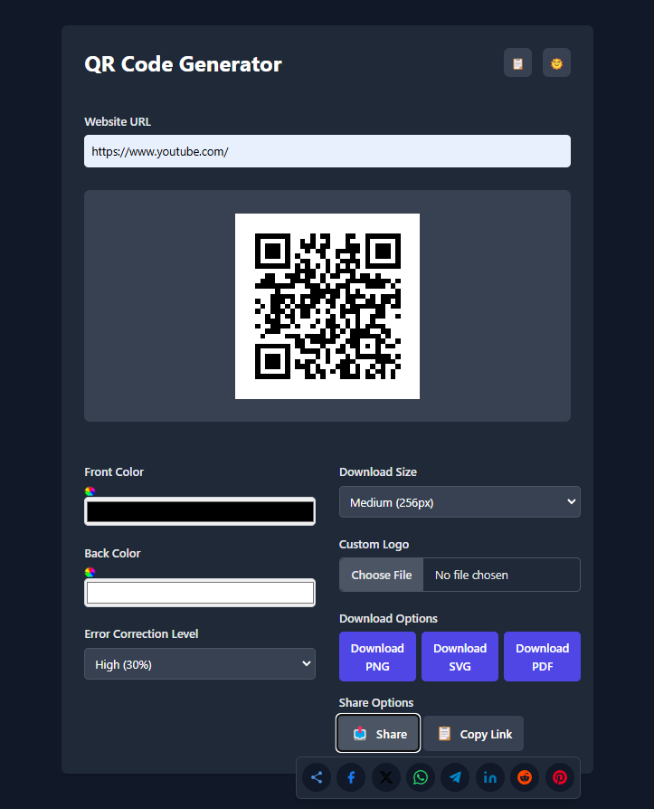

# QR Code Generator

QR Express is a powerful, modern QR code generator built with React.js and TypeScript. This intuitive web application allows users to create, customize, and share QR codes effortlessly. With features like real-time preview, dark mode support, and multiple export options, users can generate professional QR codes for any purpose. The application includes advanced customization options such as color selection, error correction levels, and logo integration, making it perfect for both personal and business use.

<p align="center">
  
</p>

## Features

- 🎨 **Customizable QR Codes**
  - Adjust colors (foreground and background)
  - Multiple error correction levels
  - Custom logo upload support
  - Various download sizes

- 💾 **Multiple Export Options**
  - PNG format
  - SVG format (scalable vector)
  - PDF format
  - Configurable sizes

- 📱 **Sharing Capabilities**
  - Native share on supported devices
  - Direct copy to clipboard
  - Social media sharing
  - URL history tracking

- 🌓 **User Experience**
  - Dark/Light mode
  - Responsive design
  - Accessible UI
  - URL history with quick access
  - Real-time QR code preview

## Tech Stack

- **Frontend Framework**
  - React 18
  - TypeScript
  - Vite (build tool)

- **Styling**
  - TailwindCSS
  - PostCSS

- **Testing**
  - Vitest
  - React Testing Library
  - Jest DOM utilities

- **QR Code Generation**
  - qrcode.react
  - jsPDF (for PDF export)

- **Development Tools**
  - ESLint
  - TypeScript ESLint
  - Prettier (code formatting)

## Getting Started

### Prerequisites

- Node.js (v14 or higher)
- npm or yarn

### Installation

1. Clone the repository:
   ```bash
   git clone [repository-url]
   cd qr-code-generator
   ```

2. Install dependencies:
   ```bash
   npm install
   ```

3. Start the development server:
   ```bash
   npm run dev
   ```

4. Open [http://localhost:5173](http://localhost:5173) in your browser

### Building for Production

```bash
npm run build
```

The build artifacts will be stored in the `dist/` directory.

### Running Tests

```bash
# Run tests in watch mode
npm test

# Run tests with coverage
npm run coverage
```

## Project Structure

```
src/
├── components/           # React components
│   ├── QRCodeDisplay    # QR code rendering
│   ├── QRCodeSettings   # Customization options
│   ├── ExportSettings   # Download/share options
│   └── ShareOptions     # Sharing functionality
├── hooks/               # Custom React hooks
│   ├── useDarkMode     # Theme management
│   └── useQRHistory    # URL history management
├── types/               # TypeScript definitions
├── constants/           # Global constants
└── tests/              # Test files
```

## Contributing

1. Fork the repository
2. Create your feature branch (`git checkout -b feature/AmazingFeature`)
3. Commit your changes (`git commit -m 'Add some AmazingFeature'`)
4. Push to the branch (`git push origin feature/AmazingFeature`)
5. Open a Pull Request

## Testing

The project uses Vitest and React Testing Library for testing. Tests are co-located with their corresponding components/hooks. Key testing areas include:

- Component rendering and interactions
- Hook functionality
- User interactions
- Dark mode switching
- QR code generation
- File download functionality
- Sharing capabilities

## Browser Support

The application supports all modern browsers:

- Chrome (latest)
- Firefox (latest)
- Safari (latest)
- Edge (latest)

## License

This project is licensed under the MIT License - see the [LICENSE](LICENSE) file for details.

## Acknowledgments

- [qrcode.react](https://github.com/zpao/qrcode.react) for QR code generation
- [TailwindCSS](https://tailwindcss.com/) for styling
- [Vite](https://vitejs.dev/) for the build system
- [React Testing Library](https://testing-library.com/docs/react-testing-library/intro/) for testing utilities

## Deployment

### GitHub

1. Create a new repository on GitHub
2. Initialize git and push your code:
   ```bash
   git remote add origin https://github.com/username/qr-code-generator.git
   git branch -M main
   git push -u origin main
   ```

### Netlify Deployment

1. Sign up/Login to [Netlify](https://www.netlify.com/)
2. Click "Add new site" > "Import an existing project"
3. Connect with GitHub and select your repository
4. Configure the deployment settings:
   - Build command: `npm run build`
   - Publish directory: `dist`
   - Node version: `16` (or higher)
5. Click "Deploy site"

#### Environment Variables (if needed)
Add any required environment variables in Netlify:
1. Go to Site settings > Build & deploy > Environment
2. Add variables as needed

#### Custom Domain (Optional)
1. Go to Site settings > Domain management
2. Add your custom domain
3. Follow Netlify's DNS configuration instructions